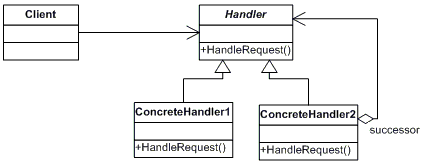

# Chain of Responsability

---

## Definition

This pattern creates a chain and passes the object along this until someone handles it.

## Diagram

## Real example

The example code shows a rule engine, where there are sequential rules to be executed.

The process will stop if any criteria are met or none of them and all rules run successfully.